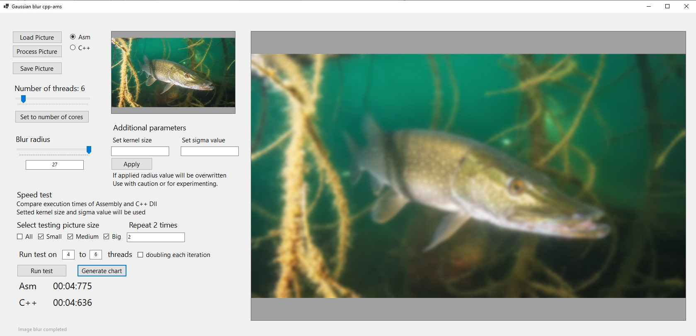
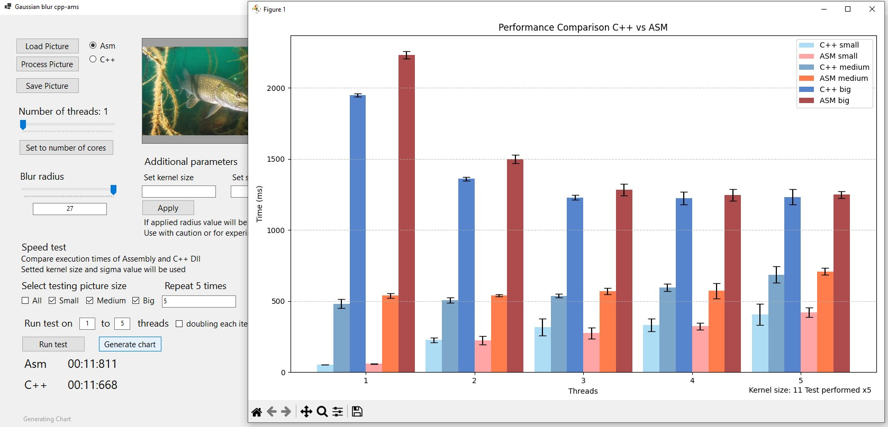
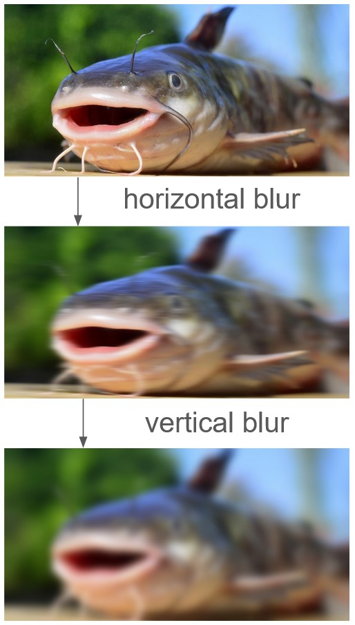
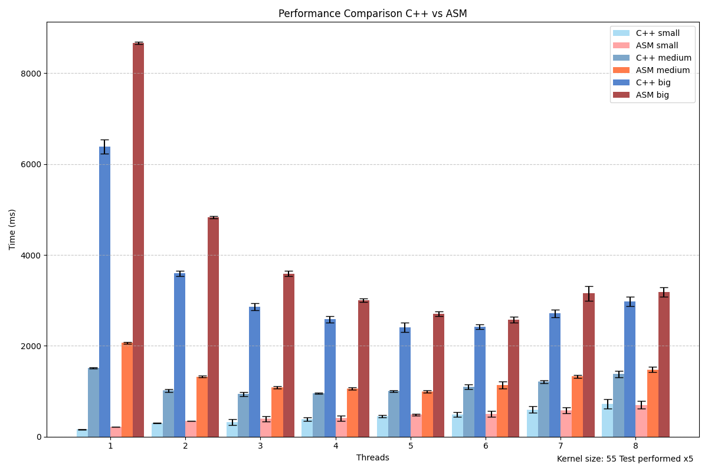
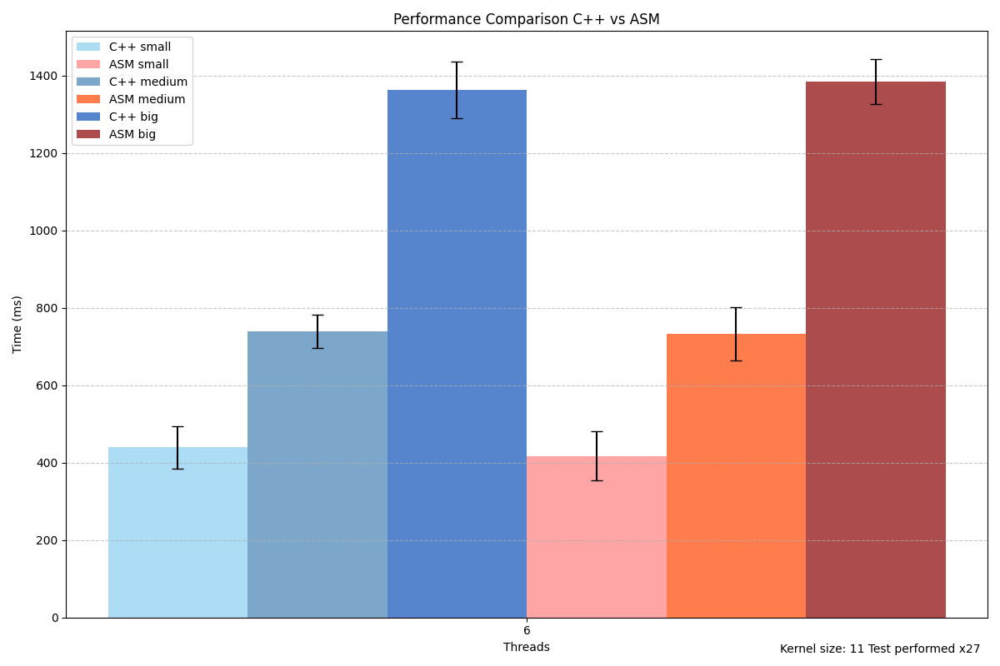

# Performance Comparison of C++ and Assembly Libraries  

## Project Overview  
This project was developed during the 5th semester as part of an assembly language course.  
It focuses on comparing execution times between custom C++ and Assembly libraries.  
The implemented libraries apply a Gaussian blur filter to an image.

Presentation in English and final project report in Polish available in the folder "other".

## **Before and After**  
  

## **UI** 

## **Process Visualization**  
|                       |  
|:---------------------:|  
|  |  

## **Performance Data Charts**  
 
   
